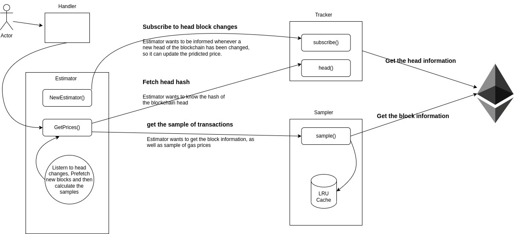

# yaegpe
Yet Another Ethereum Gas Price Estimator

## Getting started
First clone the project using:
```
git clone git@github.com:ArmanMazdaee/yaegpe.git
cd yaegpe
```

This part assumes you have `Docker` installed on your machine. Then start the project using:
```
make start
```
This will start serving the application on `0.0.0.0:8080`.

You can also see the logs and stop the server using:
```
make logs
make stop
```

Tests can be run respectively with:
```
make test
```

## Architecture

### Overview
* Tracker is responsible for following the changes to the head of the blockchain and also informing the estimator of the changes
* Sampler is responsible for collecting a sample of gas prices from a specific block and returning it to the estimator
* The estimator uses the retuned gas prices from the sampler to predict the appropriate gas price. Also, it caches the results and invalidates cache on changes to the head.

### Design Criteria
* Service should put the minimal load on the Ethereum node and any cachable data should be requested only once
* Upcoming request data should be prefetched and cached in advanced
* Predicted prices should be updated as soon as a new block gets minted to the blockchain
* Each component should be testable in isolation

### Assumptions
The system requires to be run against an Ethereum node with Londen fork enabled.

## License
Distributed under the MIT License. See [`LICENSE`](LICENSE) for more information.
